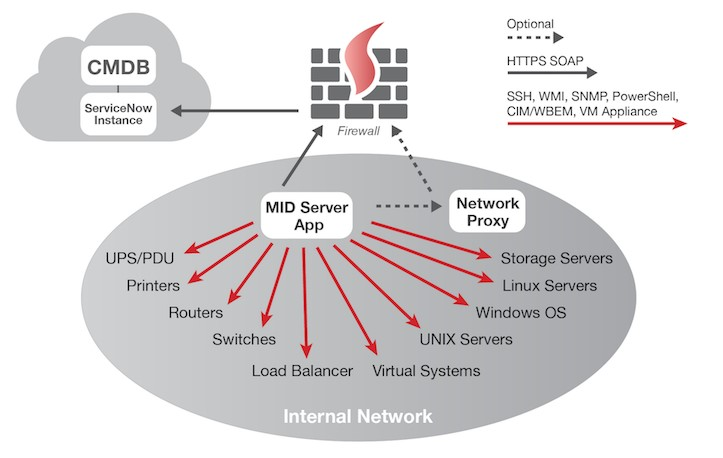

**1 - Mid-Server Deployment considerations based on firewall footprint, and traffic through the firewalls of different network segments.**

# Network Considerations 

Network considerations are simplified as a result of ServiceNow being delivered as a platform as a service (PaaS) on the ServiceNow cloud. Network considerations predominantly relate to the deployment of ServiceNow MID Servers required to support discovery.

With the deployment of ServiceNow MID Servers within the Customer environment consideration will need to be given to firewall access 
requirement between the ServiceNow MID Server and the target devices. In addition to firewall considerations for target devices within the 
Customer network the ServiceNow MID Server will also require access to communicate with the ServiceNow application. Importantly the 
ServiceNow MID Server requires no inbound connections.

ServiceNow MID Servers configured to support Discovery will also require access to connect to target devices in order to run discovery probes. All target devices within the Customer network should be configured to allow ServiceNow MID Server connection. The ServiceNow MID Server itself should also be configured with the appropriate connection privileges.

**Note: - MID server should be installed inside of the customer firewall so that any kind of the communication can happened with customer environment devices easily.**

Below should be flow diagram for MID server installation.  

## Network Communication Protocols

ServiceNow uses TCP/IP as its communication protocol. It is therefore important to identify the network communication protocols in use throughout the network, in order to facilitate any decision(s) surrounding network communication protocols and their impact.

---

**2 - How to handle a widely dispersed set of locations for example a customer that  has 15 locations with 10 servers at each.**

# Widely Dispersed Location/DC Consideration
## Introduction

We are assuming there is widely dispersed network across the globe and mentioned steps will help how to handle 
these kinds of the environments. Widely dispersed network is pain of the customer and service now helping to resolve it in proper way as well as collect the Asset details.
There are two option Which we can adopt to start the discovery. 
- One MID server 
- Multiple MID server

### One MID server (Multiple Location/Datacenter)

Service Now can use a single MID server to discover all the asset which are located worldwide but if customer agreed to open the required port from MID server to across the Datacentre or location.
Mostly customer denied using this option due Inhouse Security Policies, Network Security etc. 
If customer is ready to use this option than below is the architecture.

### Multiple MID server (Multiple Location/Datacenter)

Service Now also having to connect with multiple MID server to discover all the asset which are located worldwide & this option can be used if customer didn’t agree to open the required ports from one MID server to across the Datacentre or location.

---

**3 - Ports and Protocols that would need to be opened on firewalls or OS platform firewalls.**

# MID Server Pre-Requisites
## Introduction

The Management, Instrumentation, and Discovery (MID) Server is a Java application that runs as a Windows service or UNIX daemon on a server in your local network.

The MID Server facilitates communication and the movement of data between a ServiceNow instance and external applications, data sources, and services.

## Applications that use MID Servers

> ServiceNow Applications
  - Discovery
  - Orchestration
  - Service Mapping 
  - Event Management
  - Operational Intelligence
  - Cloud Management

>Other Applications
  - Import Sets
  - Altiris
  - Microsoft SMS/SCCM
  - LANDesk Maintenance Suite
  - HP OpenView Operations 
  - Microsoft System Center Operations Manager (SCOM)
  - Borland Starteam Integration
  - Microsoft MIIS
  - Service Assurance

## Operating System Software

The ServiceNow MID Server component of the ServiceNow application can support physical or virtual machines running 32-bit or 64-bit operating systems. Vendor tested operating systems include: 
	- Windows Server 2003, 2008 and 2012 on physical 
	- Linux (where 64-bit the 32-bit GNU C Library is required) 

Windows Server 2012 is recommended for deployment of ServiceNow MID Server.

## MID Server Sizing

| Component            | Values \(min\-max\)                                                      |
|:--------------------:|:------------------------------------------------------------------------:|
| CPU                  | 2\+GHZ CPU \(Multi\-core preferred\)                                     |
| Disk                 | 500MB of disk space per ServiceNow   MID Server deployed                   |
| Memory               | 4GB of available RAM per application                                     |
| Network              | 100 Mbps\. Recommend 1000 Mbps\.    ServiceNow MID Server uses TCP port 443 |
| Application Software | Java Developer Kit                                                       |

# Network (Ports & Protocols)
## Port Information

ServiceNow MID Servers configured to support Discovery will also require access to connect to target devices in order to run discovery probes. All target devices within the Customer network should be configured to allow   ServiceNow MID Server connection. The ServiceNow MID Server itself should also be configured with the appropriate connection privileges.

---

**4 - credentials for the different types of protocols and the access rights on the endpoints**
# Discovery Pre-requisite
## ServiceNow Discovery

The three methods used for discovering various devices on a network are SSH, WMI and SNMP. SSH is used for accessing UNIX-like machines. Discovery logs into a machine with SSH and runs commands within an encrypted session to gather system information. Orchestration logs in to UNIX and Linux machines using SSH to perform Workflow activities. WMI is used by Discovery for Windows based machines and is used for querying the remote WMI protocol on targets for gathering of Windows information. Orchestration uses PowerShell to run activities on Windows machines. And lastly, SNMP v1/v2 is used on various network devices (Routers, Switches, Printers) by Discovery and Orchestration. Detailed information is listed below about these methods.

## SSH – UNIX

For UNIX-like machines, Discovery and Orchestration use SSH protocol, version 2 to access target machines. SSH is a network protocol that allows data to be exchanged using a secure channel between two networked devices. SSH communicates on port 22 within an encrypted data stream and requires a login to access the targets using two available methods of authentication: a username and password combination and a username and shared private key. Specify SSH authentication information and type in the Credentials module. If multiple credentials are entered, the platform tries one after the other until a successful connection is established, or all are ultimately denied. To provide for application relationships a limited number of SUDO commands must be available to be run. Additional details to these requirements can be found in UNIX/Linux commands requiring root privileges for Discovery and Orchestration.

## WMI – Windows

For Windows machines, Discovery uses the Windows Management Instrumentation (WMI) interface to query devices. Due to Microsoft security restrictions for WMI, the ServiceNow MID Server application executing the WMI queries must run as a domain user with local (target) administrator privileges. When Discovery detects activity on port 135, it launches a WMI query. The response from the Windows device is sent over a Distributed Component Object Model (DCOM) port configured for WMI on Windows machines. This can be any port. Ensure that the ServiceNow MID Server application host machine has access to the targets on all ports due to the unique nature of the WMI requirements.

## SNMP – Network

For network devices, Discovery uses a SNMP scan to get device specific MIBs and OIDs. SNMP is a common protocol used on most routers, switches, printers, load balancers and various other network enabled devices. Use a "community string" (password) for authentication when scanning a device via SNMP. Many devices have an out-of- box community string of public which Discovery (by default) uses when querying a target. Define additional community strings in the Credentials module which are tried in succession, along with public, until a successful query return. In addition to the credentials, the platform also requires the ability to make port 161 SNMP requests from the ServiceNow MID Server to the target. If Access Control Lists (ACLs) are in place to control the IP addresses that can make these queries, ensure that the IP address of the ServiceNow MID Server is in the ACL. ServiceNow Discovery supports SNMP versions 1 and 2c. 

The out-of-box Orchestration activity SNMP Query returns the OID of a device and requires SNMP credentials.

## WBEM (Storage)

Web-Based Enterprise Management (WBEM) defines a implementation of the Common Information Model (CIM): including protocols for discovering and accessing each CIM implementation. WBEM requires either of two ports, 5989 or 5988 and uses the HTTP transport protocol. WBEM supports SSL encryption and uses CIM username/password credentials. ServiceNow Discovery launches a WBEM port probe to detect activity on the target ports and to append gathered data to a classification probe that explores CIM Servers.

**The CIM credentials can be different than the credentials for the system hosting the CIM server. Because the SMI-S provider caches storage device information, the Discovery query to the provider does not affect storage device performance.**

## Cloud Discovery

Cloud discovery finds resources in Amazon Web Services (AWS) and Azure clouds, and then populates the CMDB with the relevant CIs and relationships. Cloud discovery also supports changes to your CIs based on AWS and Azure events.
For more Information Please check the mentioned Link
[Cloud Discovery](https://docs.servicenow.com/bundle/madrid-it-operations-management/page/product/discovery/concept/cloud-discovery.html)

# MID Server Configuration

Install MID Servers with the MID Server installation package and verify it is active. The package includes an installer that automatically configures OpenJDK to run in the environment. The MID Server can use an existing JRE rather than the provided OpenJDK. Uninstall the MID Server to redeploy it. 

**Before you begin**

Verify that the host computer satisfies the MID Server system requirements (Point 4 MID Server Pre-Requisites).
Ensure that the Microsoft Application Experience Lookup Service is enabled on the MID Server host. If this service is disabled, the MID Server auto-upgrade might fail, causing the MID Server to go down.

## Installation
* Log in to the Windows host machine where you want to install the MID Server.
* Create a folder for the MID Server on the top level of the drive such as ServiceNow\MID Server1.
* Download the MID archive file into the new folder.
* Right click the archive and select Extract All.
* Navigate to the service-now\<mid server name>\agent folder that was created when the file was extracted.
* Run installer.bat to start the MID Server installer.
	* Use the installer to enter the following information 
* Click Test your connection to validate the credentials and instance information. If you encounter any errors, verify the information that you input.
* Click Next.
* Configure the MID name parameters (see table)
* Click Next to view the summary.
* Click Start MID Server.
* The local host starts the MID Server.
* Note: If the MID Server fails to start, the cause might be a duplicate name or multiple services that point to the same executable path. See MID Server fails to start for details.
* Click MID Server List Page.
* The installer opens the MID Server list from your instance.
* Select the MID Server name from the list.
* Note: It may take a few seconds for the MID Server time to establish a connection with your instance
* The system displays the MID Server record.
* From Related Links, click Validate.
* The MID Server Validated changes to Yes.

## Validation

You must manually validate the MID Server after it is installed to enable it to execute automation tasks. You can invalidate a MID Server you suspect has been compromised to prevent it from accessing automation credentials in the instance or executing outbound ECC probes.

### Procedure
* Navigate to MID Server > Servers.
* Open the new MID Server you created from the list of MID Servers.
* Under Related Links click Validate.
* The Set Initial Selection Criteria window appears if there are no records in the Supported Applications, IP Ranges or Capabilities related lists.
* On the Set Initial Selection Criteria window, use the switches to enable or disable selection criteria for this MID Server:
	* Allow all capabilities for Orchestration and Event Management to use this MID Server.   **Note: Service Mapping and Event Management alert aggregation and RCA, which used capabilities in previous releases, rely on the application for MID Server selection.**
	* Allow all applications that use MID Servers to use this MID Server.
	* Allow all IP ranges: Make all IP ranges valid for this MID Server, meaning that it can target any IP address.
* Setting Initial selection criteria
* If you click Cancel, the validation continues but none of the capabilities, applications, or IP ranges are added.
* Click OK.
* The Validated field on the dashboard is set to Validating, and then set to Yes after the validation completes.
* To invalidate a MID Server, open the record for the MID Server you suspect has a security issue.
* Under Related Links, click Invalidate.
* Invalidating a MID Server forces it to clear its memory and restart. The MID Server generates a new keypair on restart.

	

